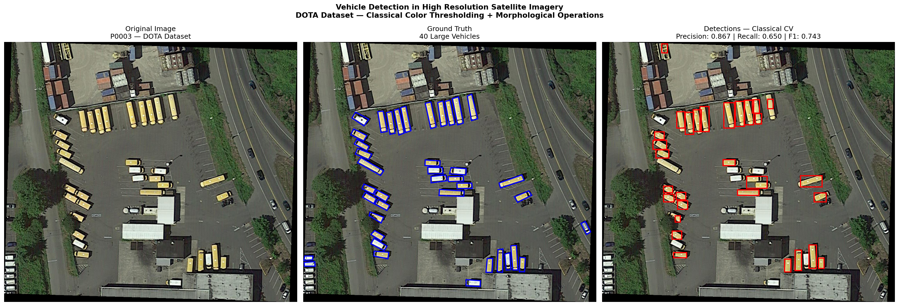

# Vehicle Detection in High Resolution Satellite Imagery
I've worked with object detection workflows on the user interface side — reviewing outputs, validating results, flagging false positives. I wanted to understand what's actually happening under the hood, so I built this pipeline from scratch.

## Problem Statement
Manual analysis of high resolution satellite imagery is time-consuming 
and impractical at scale. Automated vehicle detection enables rapid 
identification of military assets, convoy monitoring, and border 
surveillance without human intervention — critical for defence and 
intelligence applications.

## Approach
I started with a classical approach to understand the fundamentals before moving to deep learning:
1. Convert image to HSV color space
2. Apply yellow color thresholding to isolate vehicles
3. Morphological operations (closing + opening) to remove noise
4. Connected component analysis to identify vehicle blobs
5. Size filtering to remove false detections
6. IoU-based matching against ground truth for evaluation

## Dataset
- DOTA-v1.0 (Detection in Optical Remote Sensing Images)
- Image resolution: 0.5m - 1m GSD (matching KaleidEO OPT 50 payload)
- Image: P0003
- Ground truth: 40 large vehicles, 15 small vehicles

## Results
| Metric | Value |
|--------|-------|
| True Positives | 26 |
| False Positives | 4 |
| False Negatives | 14 |
| Precision | 0.867 |
| Recall | 0.650 |
| F1 Score | 0.743 |

## Limitations
- Color thresholding only detects yellow/bright vehicles
- Camouflaged or dark vehicles are not detected
- Closely parked vehicles may be grouped into single detections
- Axis-aligned bounding boxes vs oriented ground truth boxes
- Classical approach not scalable for production defence systems

## Future Work
- Multispectral detection to handle camouflage
- Deep learning (YOLOv8) for multi-class detection
- SAR imagery integration for all-weather detection
- Oriented bounding box detection matching DOTA annotation format

## Tools Used
Python, OpenCV, NumPy, Matplotlib, DOTA Dataset
